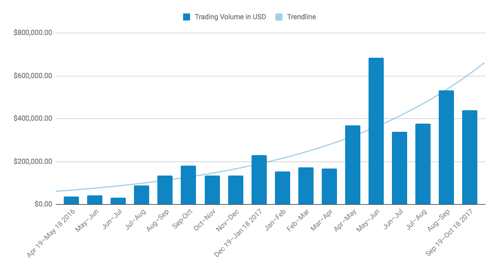
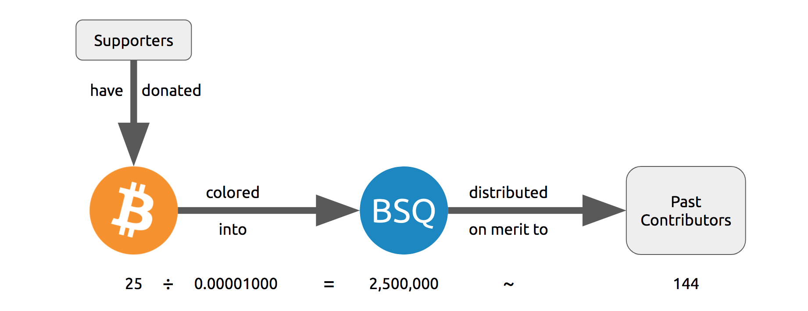
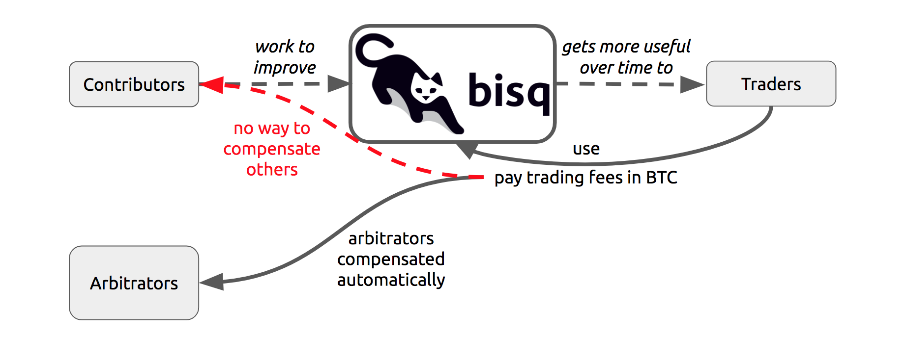
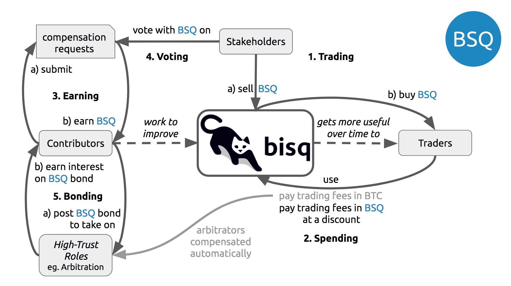
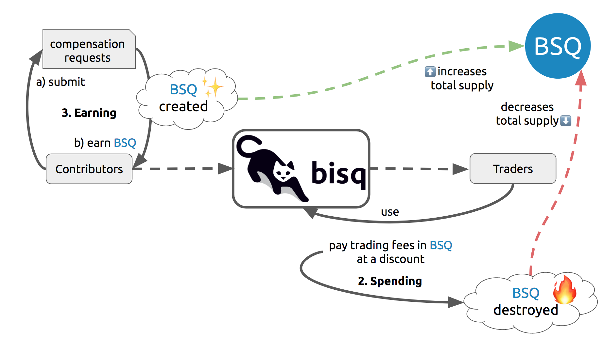

= Phase Zero: A Plan for Bootstrapping the Bisq DAO

Chris Beams  +
mailto:chris@beams.io[chris@beams.io]

Manfred Karrer +
mailto:mk@nucleo.io[mk@nucleo.io]

October 19, 2017

[abstract]
*Abstract.* We present an overview of Bisq, a peer-to-peer exchange network designed for secure, private and censorship-resistant trading of bitcoin for national currencies and other cryptocurrencies. We demonstrate that while Bisq already provides users with a high degree of security and privacy through decentralized architecture and other protections, the project cannot achieve the degree of censorship resistance it requires without first decentralizing its funding and governance. We review the Bisq DAO and BSQ token that have been designed to achieve this goal and we analyze the risks inherent to rolling them out. We conclude by presenting the _Phase Zero_ plan for a pre-release period in which each aspect of the Bisq DAO is operationalized in an incremental and risk-mitigating fashion. Compensation, voting, bonding and other DAO use cases commence immediately as high-trust operations in a testing environment and iterate toward trust-minimized operations in production. BSQ stake is tracked on Bitcoin testnet during Phase Zero such that BSQ may be earned but not traded or spent. Completion of Phase Zero is marked by a BSQ genesis distribution on Bitcoin mainnet and a Bisq application release supporting BSQ trading and other key DAO use cases.

= Introduction

Bisq's peer-to-peer bitcoin exchange network has been in operation for 18 months now. Exchange volumes have grown along the way, and now is the time for Bisq's community of contributors to grow along with them. We have designed the Bisq DAO, a _decentralized autonomous organization_,footnote:[Wikipedia, "Decentralized autonomous organization", https://en.wikipedia.org/wiki/Decentralized_autonomous_organization, October 2017] to support that growth by decentralizing the funding and governance aspects of the project. This document is written to provide a clear understanding of both Bisq and the Bisq DAO, and then to lay out a specific plan for bootstrapping the Bisq DAO into operation.

*Audience.* This document is intended primarily for current and future Bisq contributors, but has been written to be understood by anyone familiar with the Bitcoin ecosystem. If you are interested in working to improve Bisq, or simply interested in where the project is going, read on.

*Organization.* This document is divided into two major parts followed by several appendices:

 - *_<<Part-I>>_* provides a overview of and rationale for <<what-bisq-is,the Bisq project>>, <<the-bisq-dao-and-bsq-token,Bisq DAO and BSQ token>>, then concludes with an analysis of <<risks,risks>> inherent to launching the Bisq DAO;

 - *_<<Part-II>>_* presents a set of <<actions>>, <<techniques>> and <<principles>> designed to bootstrap the Bisq DAO into operation while <<risk-mitigation,minimizing risk>>, then specifies <<exit-criteria>> for Phase Zero and concludes with a high-level <<roadmap,roadmap>>;

 - *_<<Appendix-A>>_* defines the roles individuals play when participating in the Bisq DAO, such as _<<trader,trader>>, <<contributor,contributor>>_ and _<<stakeholder,stakeholder>>,_ and defines several categories of high-trust <<bonded-contributor-roles,_bonded contributor roles_>> such as _<<maintainer,maintainer>>, <<operator,operator>>,_ and _<<administrator,administrator>>;_

 - *_<<Appendix-B>>_* lists the GitHub repositories and other tools used to maintain and operate the Bisq DAO;

 - *_<<Appendix-C>>_* calls out the actions each Bisq DAO user role can perform during Phase Zero.

*Feedback.* Please ask questions and provide feedback on this document via issues and pull requests in the <<docs-repo>>. Alternatively, post questions in the https://bisq.community[Bisq Forum], chat with us in <<slack>>, or email the authors directly.

*Updates.* This document will remain https://github.com/bisq-network/docs/commits/master/dao/phase-zero.adoc[open to revision] throughout Phase Zero. Watch the <<docs-repo>> to be notified of changes or subscribe to this document's https://github.com/bisq-network/docs/commits/master/dao/phase-zero.adoc.atom[Atom feed].

*Related materials:*

 - Companion https://docs.google.com/presentation/d/1G5_6Kju2OoItZ5lD0jnskqLdOV2dAJpdB6WOjmq9hRk/edit#[slide deck] as delivered at the https://liberate.hcpp.cz/[Hackers Congress 2017] conference in Prague
 - 15-minute https://www.youtube.com/watch?v=AvXWToT-dcQ[video interview] with World Crypto Network covering Bisq, the Bisq DAO and the Phase Zero plan
 - Detailed https://github.com/bisq-network/docs/blob/master/dao/specification.adoc[technical specification] for the Bisq DAO and BSQ token

= Part I: Understanding Bisq and the Bisq DAO [[Part-I]]

== What Bisq is

Bisq is a *decentralized bitcoin exchange* best understood in terms of its major component parts:

 1. Bisq is a cross-platform *desktop application* that allows anyone to buy and sell bitcoin in exchange for national currencies and other cryptocurrencies.

 2. Bisq is a *trading protocol* that enables individuals to exchange directly with one another over the internet, eliminating the need for trusted third party exchange services.

 3. Bisq is the *peer-to-peer network* formed by Bisq applications discovering, connecting to, and working with one another to implement the Bisq trading protocol. The Bisq network is _fully_ peer-to-peer in that it requires no centrally-controlled servers and has no single points of failure.

Bisq is *not a company*. Bisq is *free software* released under version 3 of the GNU Affero General Public License. Bisq is _built_ by individuals around the world who choose to work together, and Bisq is _used_ by individuals around the world who choose to trade with Bisq over many other exchange alternatives.

== Why Bisq exists

Bisq's mission is to provide a *secure*, *private* and *censorship-resistant* way of exchanging bitcoin for national currencies and other cryptocurrencies over the internet.

When we say *secure*, we are referring to the safety of users' funds. Today, most bitcoin exchanges are _centralized_, requiring users to store their bitcoins--for at least some amount of time--on exchange servers. When thousands of users do this, it creates extreme incentives for those servers to be hacked and for those users' bitcoins to be stolen. And time and time again these hacks and thefts are exactly what happen.

When we say *private*, we are referring to users' ability to control access to their own information. Today, most centralized exchanges require users to divulge personally identifying information in order to set up an account, and then in turn link users' trading activity to their respective identities. This practice creates extreme risks for users that their personal details and financial information will be stolen, leaked or otherwise used against their own best interests.

When we say *censorship-resistant*, we are referring to users' ability to voluntarily trade with one another without interference from a third party. Today, centralized bitcoin exchanges are highly susceptible to such interference. By their nature, they must operate within one legal jurisdiction or another, putting them at risk of being fined or shut down if they do not comply with the laws and other rules of that jurisdiction, which may include restrictions on who can trade and what can be traded, and almost always include requirements to collect personal information as described above.

What's needed is an exchange where *users keep control of funds*, that *is private by default*, and that *defends freedom of transaction*. We built Bisq to meet these needs.

Where Bitcoin's motto is "be your own bank," Bisq's is "*be your own exchange.*"

== How Bisq works

=== In a nutshell

Imagine you want to buy bitcoin (BTC) in exchange for US dollars (USD). In Bisq terminology, you are a _buyer_ of BTC looking for a _seller_ of BTC who will accept USD as payment. To complete such a trade using Bisq, you would follow a series of steps similar to these:

 . You download and run the Bisq application on your laptop or desktop computer
 . You configure Bisq with your USD payment method details
 . You browse Bisq's offer book for existing offers to sell BTC for USD
 . You take an existing offer, agreeing to buy the seller's BTC for your USD
 . You send USD from your bank to the seller's bank and indicate you have done so in Bisq
 . You and the seller wait for your USD payment to arrive at the seller's bank
 . The seller receives your USD and indicates they have done so in Bisq
 . You receive the seller's bitcoin and the trade is complete

These steps can vary in a number of ways depending on whether you wish to buy or sell bitcoin, whether you are the _maker_ or the _taker_ of an offer, which payment methods you have access to, and so on. But in any case, the steps above are rather different than those one would follow to complete a similar trade on a centralized exchange.

=== How trading with Bisq is different

Beyond the obvious difference that Bisq is a desktop application and not a browser-based web application, the first difference experienced traders will notice is that there is *no automatic order matching* on the Bisq exchange. Rather, Bisq users manually search for and select specific offers they wish to take. This approach enables truly peer-to-peer trade settlement, and ensures that users are in control of which counterparties they trade with.

Bisq is also unique among decentralized bitcoin exchanges in the way it coordinates *out-of-band fiat payments*. Bisq does not directly integrate with banks or other national currency payment systems in any way. Rather, Bisq's trading protocol orchestrates the process of buyer and seller working together to settle fiat payments _outside of_ the Bisq application, as demonstrated in steps 5&ndash;7 of the trading example above.

These and other differences result in a key tradeoff for Bisq users--one in which *trade settlement takes longer*, but *trading itself is far more secure, private and censorship-resistant*.

=== How Bisq keeps funds secure

 - Bisq is *entirely non-custodial*; users stay in control of fiat and cryptocurrency funds
 - Trades include *security deposits* from buyer and seller to prevent fraud
 - Trading funds and security deposits are locked in a *2-of-3 multisig escrow*
 - Disputes are handled through a *decentralized human arbitration system*

=== How Bisq keeps data private

 - Using Bisq requires *no registration or centralized identity verification*
 - Every Bisq application is a *Tor hidden service*
 - Bisq has *no central servers or databases* to record data
 - *Data is encrypted* such that trade details are readable only by counterparties

=== How Bisq resists censorship

 - Bisq's network is a *fully distributed P2P network*, and thus difficult to shut down
 - Bisq's network is *built on top of Tor*, and thus inherits Tor's own censorship resistance
 - *Bisq is code*, not a company; it is not incorporated, and it cannot be disincorporated

== Bisq's current status

=== Track record

After two years of development and testing, Bisq went into production on April 19th, 2016--18 months ago at time of writing in October 2017. Since then, the network has processed 5,200 trades worth a total of $4.1MM USD without downtime or major incident.

=== Growth rate [[growth-rate]]

Bisq is still small, but has been growing steadily. The USD volume of bitcoin exchanged through the network has doubled roughly every 3½ months since the project went live, from $36K in April 2016 to $438K in September 2017. This growth has been organic, with minimal marketing.

._Bisq global monthly trading volume in USD, April 2016&ndash;October 2017_

=== Funding

Bisq is designed to be funded directly by its users through _trading fees_. Trading fees are paid by both buyer and seller on every trade, and are received by each trade's arbitrator in compensation for the service they provide. As of October 2017, these trading fees total around one bitcoin per month, distributed to two arbitrators who are also the project's founders and principal developers. These funds are insufficient to cover expenses and as a result the project remains funded in part by founder savings.

Fortunately, as mentioned above, Bisq trading volumes are growing, and total monthly trading fees are growing along with them. As such, it is reasonable to expect that trading fees will soon be sufficient to cover expenses, and even to compensate additional, non-arbitrator contributors. But as these additional funds come in, a new problem arises with them. As mentioned above, Bisq's trading fees currently compensate _arbitrators_ in a direct, automatic, and decentralized way, but the current approach is limited in that it _only_ compensates arbitrators. What's needed is a mechanism that can compensate _all kinds_ of contributors in an equally decentralized fashion.

=== Governance

Bisq's _technology_ is fully decentralized, but its _governance_ is not. Today, the Bisq project consists of a small team of active contributors, where most maintenance, operation and administration duties are carried out by project founders, and where those founders make virtually all major decisions. While this approach has worked well enough to bring the project to its current state, it is no longer sustainable if Bisq is to continue to grow. First, because it does not scale; project founders have become bottlenecks incapable of addressing all user needs. Second, because it introduces _censorship risk_ to have responsibility centralized in a small group of people. What's needed is a way to decentralize responsibility and high-trust duties away from project founders and into the hands of other competent and reputable contributors.

=== Summary: What Bisq needs now

As mentioned above, Bisq's mission is to provide a secure, private and censorship-resistant way to exchange bitcoin for national currencies and other cryptocurrencies over the internet. Today, Bisq is delivering on the first two aspects of this mission--indeed, we believe Bisq to be among the most secure and private exchange options currently available. Where Bisq falls short on this mission is in the third aspect of _censorship resistance._ Bisq's P2P architecture, use of Tor as a transport layer, and other built-in protections give the project a significant degree of _technical_ censorship resistance, but with regard to _funding_ and _governance_, the Bisq project remains vulnerable so long as these two critical factors remain centralized.

To fully realize its mission, what Bisq needs now are four things:

 1. *Continued trading volume growth* to increase capacity to compensate contributions
 2. *More contributors and contributions* to improve Bisq and foster that volume growth
 3. *A decentralized funding model* to feasibly incentivize those contributors
 4. *A decentralized governance model* to avoid censorship and other centralization risks

In the next section, we'll see how the Bisq DAO and BSQ token have been designed to address these needs.

== The Bisq DAO and BSQ token

=== The BSQ token

We introduce a token, BSQ, designed to facilitate a transfer of value from the traders _using_ Bisq to the contributors _maintaining_ it.

BSQ is Bisq's own custom implementation of the _colored coin_ concept.footnote:[Bitcoin wiki, "Colored coins," https://en.bitcoin.it/wiki/Colored_Coins, November 2015.] From the 25 bitcoin (BTC) that have been donated to the project since its inception in March 2014, we create 2.5 million BSQ tokens, such that each BSQ token is represented on the Bitcoin blockchain by 0.00001000 BTC, or 1000 satoshis.

._Initial distribution of BSQ tokens from BTC donations_

{empty}

We distribute these 2.5 million BSQ to 144 opted-in _past contributors_ to the Bisq project, as a way of rewarding these individuals for their efforts over the years. Stake is distributed according to the relative value each contributor has added to the project over time. As will be described further below, BSQ tokens are used to vote on and make decisions about the Bisq DAO itself, and by initially distributing BSQ to past contributors, we intentionally establish the Bisq DAO as a _meritocracy_ in which those who have contributed the most value to the project in the past are those who have the most say over its future.

=== Why BSQ is needed

Today, without BSQ, traders use Bisq and pay Bisq trading fees in BTC. At the same time, contributors work to improve Bisq, and in turn make Bisq more useful to traders. This ultimately causes more traders to use Bisq more often, and a cycle of growth perpetuates. There is a limit, however, on how much growth can occur, because while trading fees paid in BTC automatically compensate arbitrators, other contributors are currently not compensated at all.

._Limitations of Bisq's current funding model_

{empty}

Bisq's current funding model has worked well enough so far mainly because the Bisq team has been so small. Bisq's founders have played most key roles in the system, including that of arbitrator, such that compensating arbitrators with trading fees has, in practice, meant compensating the project's primary contributors as well. The problem is that this approach breaks down quickly as more contributors get involved, and as explained above, it is critical to the success of the project to grow the number of contributors and to distribute responsibilities amongst them.

What's needed is a decentralized way to transfer value from traders using Bisq to contributors maintaining it, and there is no practical way to achieve this with Bitcoin alone. Accumulating and distributing trading fees using multisignature addresses and transactions could in theory provide part of the solution, but in practice these tools are still too primitive to achieve the fully decentralized and meritocratic approach required to successfully operate the Bisq DAO.

Furthermore, for a system of _compensation_ to be fully decentralized and meritocratic, an equally decentralized and meritocratic system of _governance_ is required in order to decide which contributions should be compensated and which should not; and this, too, is not practical to implement with Bitcoin alone.

It is for these reasons that BSQ is needed. As we'll see in the sections that follow, the BSQ token has been designed to overcome the challenges described above and to provide a fully decentralized and meritocratic funding and governance model for Bisq.

=== How BSQ is used

The BSQ token has five uses, also known as _utilities_ or _functions_, within the Bisq DAO:

._Uses of the BSQ token within the Bisq DAO_

 1. *Trading.* Using the Bisq exchange, (a) stakeholders sell BSQ, to (b) traders who buy it.
 2. *Spending.* Traders spend BSQ on trading fees at a discounted rate vs. BTC.
 3. *Earning.* Contributors (a) submit compensation requests for their work and, when approved by voting, (b) earn the requested amount of BSQ.
 4. *Voting.* Stakeholders vote with their BSQ to approve compensation requests.
 5. *Bonding.* Contributors (a) post BSQ bonds to take on high-trust roles, eg. arbitration, and (b) earn BSQ interest on those bonds over time.

Together, these interlocking functions of the BSQ token are designed to create, regulate, and perpetuate an internal economy for the Bisq network. *We call this economy the Bisq DAO.*

=== How BSQ is issued and destroyed

When traders spend BSQ on trading fees, they are in fact _destroying_ those BSQ. The spent tokens are not paid to or otherwise received by any individual contributor or group of contributors; rather they are _burned,_ or made to be unspendable by being _decolored_. In this way, *spending BSQ on trading fees _decreases_ the total supply of BSQ.*

Likewise, when contributors submit compensation requests for BSQ, they are in fact requesting the right to issue, or _create_ those BSQ. Each compensation request revolves around a Bitcoin transaction in the amount of satoshis required to represent the requested amount of BSQ, and when that compensation request is approved by voting, those satoshis are _colored_ such that the BSQ network validates them as spendable BSQ. In this way, *earning BSQ through compensation requests _increases_ the total supply of BSQ.*

._How BSQ is issued and destroyed_

=== How BSQ decentralizes compensation and enables monetary policy

As we've seen above, BSQ is _destroyed_ when traders spend it, and _created_ when contributors earn it. A key benefit of this approach is that spent BSQ need not—indeed, _cannot_—be stored, protected, or later distributed by any individual or group. By eliminating the need to hold and later distribute BSQ, we also eliminate a set of difficult problems and risks, including determining who should maintain control over these funds, and how they should be protected and disbursed.

Overall, this approach makes it possible to transfer value from traders to contributors in a decentralized way. The transfer happens _indirectly_ through the process of destruction and creation, but this indirection is precisely what makes it decentralized. The creation side of the transfer is intermediated by voting on compensation requests, but this is not a problem given that voting itself is a decentralized and meritocratic process.

An important property of this approach is that BSQ creation and destruction need not necessarily occur at the same rate. For example, in any given month it may be the case that more BSQ are spent by traders than are earned by contributors. In this case, the net supply of BSQ would _decrease_ during that month. Likewise, given a month in which _fewer_ BSQ are spent by traders than are earned by contributors, the net supply of BSQ would _increase_. What emerges is a form of _monetary policy_ for the Bisq DAO in which:

 1. Traders control how much BSQ is destroyed through spending;
 2. Contributors control the upper bound on BSQ creation through compensation requests;
 3. Stakeholders control how much BSQ is actually created through voting.

Of these three roles, the third is the most important from a policy perspective, as it allows stakeholders a direct means of controlling inflation (i.e. growth in the supply of BSQ). It may be prudent, especially in the early days of the Bisq DAO to operate at a certain rate of inflation in order to fund the development of features that will later result in increased trading volumes (i.e. growth in the demand for BSQ). In the long run, however, we believe the ideal steady state for the Bisq DAO will be one in which the amount of BSQ earned in any given month matches or falls just below the amount of BSQ spent, resulting in a stable or slightly deflationary supply of BSQ over time.

=== Not an ICO

Given current trends, it is important to state explicitly that *BSQ is not associated with an ICO* (initial coin offering), nor will there be any kind of crowdsale or other crowdfunding event. BSQ is a utility token being introduced into an already functioning system to make it function even better, and raising a large amount of capital up front is neither required nor desired.

=== Risks of launching the Bisq DAO [[risks]]

It is one thing to _design_ a token-based economy like the Bisq DAO; it is another thing to successfully _operationalize_ it. There are a number of risks inherent to simply "going live" with BSQ and the Bisq DAO, including but not limited to the following:

 - *Valuation risk:* token value falls too low to be viable (or rises too high too quickly)
 - *Control risk:* any kind of non-meritocratic takeover of stakeholder voting power
 - *Censorship risk:* founders are pressured before governance is fully decentralized
 - *Credibility risk:* founder-heavy initial distribution, small team, etc cause doubts
 - *Solvency risk:* trading volumes do not grow quickly enough to cover compensation
 - *Stability risk:* implementation errors cause loss of funds or other major problems

Any of these risks could be existential. What's needed is a conservative and incremental approach to bootstrapping the Bisq DAO that accounts for and mitigates these risks. In the next part, we'll see how the Phase Zero plan is designed to do that.

= Part II: The Phase Zero Plan [[Part-II]]

_Phase Zero_ is an extended pre-release period for the Bisq DAO in which the BSQ token may be earned, but not traded or spent; in which voting and other DAO operations commence in simplistic, high-trust systems and iterate toward production-ready, trust-minimized systems.

== Goal

As discussed throughout this document, the goal of the Bisq DAO is to decentralize the funding and governance of the Bisq project. The goal of Phase Zero is to *operationalize the Bisq DAO while minimizing risk*. Like most projects in the cryptocurrency ecosystem, the Bisq DAO is an experiment; we have one shot to get it "right enough" to achieve viability, and there is no need to rush. For these reasons, Phase Zero is designed conservatively, introducing safeguards and approaching the implementation of each aspect of the DAO in an incremental fashion.

== How Phase Zero mitigates risk [[risk-mitigation]]

To address *valuation risk*, we eliminate the possibility of trading BSQ during Phase Zero. A fair market value for the token must still be established in order to compensate contributors, but this value can be estimated initially and then adjusted throughout Phase Zero. On completion of Phase Zero, the value of BSQ will become entirely subject to market forces, but the fact that many contributors worked throughout Phase Zero at a given fair market value should provide a stronger price foundation for BSQ than would be present if we were to simply enable trading from day one.

To address *control risk*, we ensure that only those who have contributed value to the project are able to vote during Phase Zero. This, too, is a result of prohibiting BSQ trading: because the only way to acquire BSQ during Phase Zero is to _earn_ it, it becomes impossible to simply purchase voting power. Furthermore, it gives us time during Phase Zero to design and implement a longer-term solution for control risk in which we introduce a reputation factor into the BSQ-based voting process.

To address *censorship risk*, we systematically eliminate formal leadership roles during Phase Zero. We define the roles and responsibilities required to maintain and operate the Bisq network, and we delegate those roles to contributors who have earned enough BSQ to "bond into" them. We make it an explicit exit criteria of Phase Zero that no one contributor is responsible for more than three of these roles, and we ultimately relegate the role of "founder" to an historical one. While this approach does not eliminate the possibility of individual contributors being censored, it minimizes the damage that any given censorship can inflict on the project and maximizes the ability for pseudonymous contributors to replace those who have been censored.

To address *credibility risk*, we use Phase Zero as an opportunity to grow the set of contributors working on Bisq, by incentivizing them to earn BSQ through bounties and compensation requests. We make it an explicit exit criteria of Phase Zero to redistribute enough BSQ from founders to other contributors to fill all bonded contributor roles. This redistribution goal will take time and a considerable volume of contributions from non-founders to achieve; this is the primary reason that, as detailed below in the _Roadmap_ section, we estimate that Phase Zero will take no less than six months to complete.

To address *solvency risk*, we let the current organic growth rate of the exchange continue to play out over the Phase Zero period. By distributing well-defined units of work to a growing number of contributors, we aim to increase development velocity, implementing additional features more quickly and making the Bisq exchange that much more attractive to traders, which should in turn increase trading volume and therefore increase trading fee revenues. In any case, we "buy ourselves time" with Phase Zero to observe actual growth trends and correct course as necessary to ensure that we are growing in a way that will be likely to support the level of BSQ demand required to sustain the Bisq DAO after Phase Zero.

To address *stability risk*, we use the Phase Zero period to thoroughly test the aspects of the Bisq DAO that have already been implemented, and to implement and test the outstanding aspects that remain. As each aspect is implemented, we put it into use during Phase Zero, moving from simplistic prototypes, e.g. tracking voting by spreadsheet, to trust-minimized, production-ready systems, e.g. tracking voting on-chain with Bitcoin transactions. We protect ourselves against critical implementation errors, e.g. those that could cause loss of funds, by issuing BSQ on Bitcoin testnet during Phase Zero.

== Actions [[actions,actions]]

=== Identify past contributors

In July 2017 we put out a call inviting _past contributors_ to opt in to the initial BSQ distribution. We defined a past contributor to be anyone who had spent at least four hours of their time on improving or supporting the Bisq project; we also considered _market makers_ to be past contributors, including in that group anyone with a history of more than 20 trades.

_Status:_ *complete* with 144 past contributors opted-in.

=== Distribute BSQ to past contributors

On October 6th, 2017, we distributed https://www.blocktrail.com/tBTC/tx/2f194230e23459a9211322c4b1c182cf3f367086e8059aca2f8f44e20dac527a[25 testnet bitcoins] to 144 past contributors across 180 BSQ addresses in the initial https://explorer.bisq.network/testnet/tx.html?tx=2f194230e23459a9211322c4b1c182cf3f367086e8059aca2f8f44e20dac527a[tBSQ genesis distribution]. This action marked the <<inception,inception>> of Phase Zero.

_Status:_ *complete.*

=== Define and communicate the Phase Zero plan

In addition to writing and publishing this document, we have also adapted its content into a 50-minute talk delivered at the Hackers Congress conference in Prague on October 8th, 2017 (https://docs.google.com/presentation/d/1G5_6Kju2OoItZ5lD0jnskqLdOV2dAJpdB6WOjmq9hRk/edit#slide=id.p[slides], full video online soon). We also recorded a https://www.youtube.com/watch?v=AvXWToT-dcQ[15-minute interview] with World Crypto Network at the same event, recapping that talk. We will continue to tweet, use the Bisq newsletter and blog, give podcast interviews, and engage in other outreach activities to ensure that potential contributors are aware of the Bisq DAO and Phase Zero plan.

_Status:_ *in progress.*

=== Define bounty issues [[define-bounty-issues]]

A _bounty_ is a well-defined unit of work that potentially any contributor--especially new ones--can work on with as little prior context as possible. We post bounties in the form of <<bounty-issues>> in repositories throughout the bisq-network GitHub organization.

Initially, we post these bounties with a set price in BSQ. As quickly thereafter as possible, we move to an "open price" bounty model in which contributors specify a requested amount of BSQ when submitting compensation requests. This approach is consistent with our overall decentralization goals, and more importantly, creates a desirable set of incentives for contributors to determine what they believe to be a fair price for work, requiring them to ask around, look through prior contribution requests, and to generally "do their homework" as to what work is worth when contributing to Bisq. Ultimately, the open price bounty model is intended to foster a marketplace among contributors doing work and stakeholders voting on that work such that a market price for Bisq work is discovered.

Completed work for a bounty is, whenever appropriate, submitted as a GitHub pull request. We follow a C4-based process in which each repository in the bisq-network GitHub organization has one or more designated _<<maintainer,maintainers>>_ responsible for merging or rejecting pull requests.footnoteref:[C4,Unprotocols, "Collective Code Construction Contract (C4)", https://rfc.unprotocols.org/spec:1/C4, June 2016] Merged pull requests do not imply or guarantee in any way that the contributor will be compensated in BSQ for their work; compensation requests are managed separately from pull requests.

_Status:_ *pending.* See https://github.com/bisq-network/dao/issues/11 for details.

=== Define bonded contributor roles

We enumerate and define the roles necessary to operate, maintain and administrate the Bisq project, Bisq network and Bisq DAO, such that responsibilities can be transferred from founders to other reputable contributors. Because each of these of these roles require a degree of trust, filling the role requires putting up a BSQ bond. Initially, founders will use their BSQ stake to bond into these roles, and will then transfer those roles to contributors who (a) wish to take the role over and (b) have earned sufficient BSQ to do so.

_Status:_ *work has been started* in the <<roles-repo>>, where each role has been enumerated in the form of a GitHub issue, but most roles do not yet have a _specification,_ i.e. a detailed description of the responsibilities required to fill that role. The Twitter operator role https://github.com/bisq-network/roles/issues/21[issue] and https://github.com/bisq-network/roles/blob/master/twitter-operator.adoc[specification] are an exception, and provide an early example of what's to come for the other roles.

=== Establish and refine the fair market value of the BSQ token

Given that BSQ trading is prohibited during Phase Zero, it is not possible for normal market forces to discover a price for the BSQ token. Still, an estimated price for BSQ is required in order to compensate contributors, and we call this estimated price the _fair market value_ of BSQ, borrowing a term from traditional valuation processes.

Presently, we are working with a valuation of 1 BSQ == 1 USD. As Phase Zero progresses, we expect this estimate and the model behind it to evolve, with the goal of arriving at a maximally credible fair market value for BSQ by the completion of Phase Zero. As mentioned in the risk management section above, this process should significantly mitigate _valuation risk_ when BSQ goes live on Bitcoin mainnet.

_Status:_ *work has begun* in the <<bsq-valuation-spreadsheet>> but is *on hold* for now. See https://github.com/bisq-network/dao/issues/12 for details.

=== Submit compensation requests and other proposals throughout each month

_Status:_ *ongoing.* As of October 2017, all contributions should be captured in one or more compensation requests. See <<contributor-use-cases>> for details.

=== Vote on the first 3 days of each month

On the first three days of each month, stakeholders vote on contribution requests and other proposals that have been submitted throughout the previous month.

_Status:_ *ongoing.* The first monthly voting round https://github.com/bisq-network/dao/issues/8[was conducted] on November 6th–9th, 2017 (an exception from the usual "first 3 days" rule). The next will occur on December 1st–3rd.

=== Rebase and re-distribute BSQ on the first day of each month

After the monthly voting period is complete and new BSQ is issued, the total amount of BSQ in circulation grows by the amount of that issuance. On the first of every month, we _rebase_ BSQ stake back down to 2.5 MM BSQ, preserving the proportion of stake allotted to each contributor, and issue a new testnet genesis distribution reflecting the stake change. This is done for two reasons: (1) as an additional safeguard to prohibit BSQ trading during Phase Zero, and (2) to accurately reflect the distribution of the 2.5MM BSQ that will be issued on BSQ mainnet upon completion of Phase Zero.

_Status:_ *in progress.* The first https://github.com/bisq-network/dao/issues/9[rebasing and re-distribution] will occur on or around November 9th, 2017 (this is an exception from the usual "1st of the month rule").

=== Distribute responsibility from founders to bonded contributor roles [[distribute-responsibility]]

Initially, founders use their BSQ stake to assume all bonded contributor roles, reflecting the fact that they do already "have all the keys" and do already carry out most of these duties. As contributors earn sufficient BSQ for bonding, they can approach founders and request to take these roles over. Contributors have a twofold incentive to do so: (1) the BSQ they earn by carrying out the duties of the role, and (2) the interest they earn on their BSQ bond over time.

_Status:_ *in progress.* Initial bonding levels https://github.com/bisq-network/dao/issues/10[will be set], and founders will be officially bonded into all roles by November 30th, 2017.

=== Grow exchange volume organically

We keep marketing to a minimum during the Phase Zero period, and observe whether our current <<growth-rate,growth trend>> continues to play out on its own. Rather than focusing on growing our _user_ base, we now focus on growing our _contributor_ base. The goal is to foster continued organic growth by making Bisq ever more useful and relevant. In any case, we will track the growth trend and adjust course as necessary should it change.

_Status:_ *in progress.*

== Techniques [[techniques,techniques]]

=== Prohibit BSQ trading and spending

We prohibit buying, selling and spending BSQ tokens during Phase Zero in three ways:

 . by issuing on testnet and rendering their underlying bitcoin value worthless;
 . by disabling BSQ trading and spending functionality in the Bisq application;
 . by re-issuing a new testnet genesis distribution at the start of every month.

As a result, *BSQ utility is limited to _earning_, _voting_ and _bonding_ during Phase Zero.* See the <<risk-mitigation,risk mitigation>> section for rationale.

> _A note to past contributors: When you registered as a past contributor, you provided Bisq's founders with a mainnet BSQ address. As part of the testnet genesis distribution, we have generated a testnet BSQ address on your behalf and correlated it with the mainnet address you've already given us._

=== Track stake, voting and bonding via spreadsheet

At the beginning of Phase Zero, we use simplistic, high-trust systems such as spreadsheets to track BSQ stake, voting and bonding, and we issue BSQ on Bitcoin testnet vs mainnet. These are pragmatic decisions designed to allow our small team to move quickly and iterate toward trust-minimized, production-ready solutions. Note that the on-chain systems that will replace these spreadsheets have already been designed, and to a certain degree, already implemented. We will migrate to them as they become ready; in the meantime, spreadsheets are easy for everyone to understand and easy to change as we learn through practice what it really means to operate the Bisq DAO.

See <<how-to-vote>> for instructions.

=== Submit compensation requests as GitHub issues

Eventually, compensation requests will be modeled around Bitcoin transactions. As Phase Zero begins, however, they are modeled as GitHub issues in the <<compensation-repo>>.

See <<how-to-request-compensation>> for instructions.

== Principles [[principles,principles]]

=== Avoid contentious voting

Any conceivable change to the Bisq DAO can be submitted as a proposal, and any proposal can be put to a vote. With that said, the goal should be to vote as infrequently as possible. Where good proposals are submitted, and rough consensus is achieved, no vote is necessary.footnote:[RFC 7282, "On Consensus and Humming in the IETF", https://tools.ietf.org/html/rfc7282, June 2014] If rough consensus has not been achieved, then further work is necessary to either improve the proposal or to change minds about it. Voting on a contentious proposal should be seen as a last resort, after all attempts to achieve consensus have failed.

With the exception of compensation requests (which must be voted on in order for BSQ to be issued), voting should be regarded as a crude tool to be used only when absolutely necessary.

=== Keep it meritocratic

The Bisq DAO is founded as a meritocracy, and we believe it is critical to the long-term success of the project that it remain one. Whenever submitting or voting on a proposal to change the way the DAO works, look closely for unintended consequences that may negatively impact this meritocratic foundation.

=== Work on what you want

It is not required to work on an existing bounty issue to contribute to Bisq, and no one is here to tell you what to do. Contributors who have their own ideas are free to work in their own forks on whatever they wish, however they wish, and without any permission from Bisq stakeholders.

With that said, it's a good idea to consult with stakeholders via the Bisq forum, mailing list, or other communication channels before setting out on any serious contribution effort. Do this in order to ensure your contribution is:

 . something that the relevant maintainer(s) would be likely to merge;
 . something that stakeholders would likely vote to approve as a compensation request;
 . subjected to as as much feedback as possible while still an idea and thus cheap to change or abort.

Remember: _every contributor_ is free to work on what they want, including maintainers who may or may not want to review and merge your pull request if they don't have any prior context for it, or reason to believe it's worth spending their time on.

== Exit criteria [[exit-criteria,exit criteria]]

The following criteria must be fulfilled in order to exit Phase Zero:

 - All bonded contributor roles are filled
 - No one contributor plays more than three bonded roles
 - [TBD] Specific volume growth target or trend
 - [TBD] Specific BSQ fair market value target or trend

== Roadmap

=== Inception

Phase Zero began on October 6th, 2017 with the distribution of https://www.blocktrail.com/tBTC/tx/2f194230e23459a9211322c4b1c182cf3f367086e8059aca2f8f44e20dac527a[25 testnet bitcoins] to 144 past contributors in the initial https://explorer.bisq.network/testnet/tx.html?tx=2f194230e23459a9211322c4b1c182cf3f367086e8059aca2f8f44e20dac527a[tBSQ genesis distribution].

=== Duration

Phase Zero is expected to last at least six months. We estimate this to be the minimum amount of time necessary for contributors to earn enough BSQ to fill all bonded roles.

=== Completion

When the exit criteria for Phase Zero have been met, a vote will be put to stakeholders whether to complete the phase by (a) issuing the official genesis distribution of BSQ on Bitcoin mainnet; and (b) releasing a version of Bisq that enables BSQ trading, BSQ trading fee payment, and all other DAO use cases.

= Appendix A: Roles [[Appendix-A]]

The following are roles that individuals play when using Bisq or otherwise participating in the Bisq DAO. One individual may play any number of these roles, with the exception of _bonded contributor roles_, where no individual may play more than three.

== Trader

A _trader_ is anyone who uses Bisq to exchange with others. Traders have no specific role to play during Phase Zero, other than continuing to use Bisq as per usual. When Phase Zero is complete, traders will be able to buy BSQ tokens and spend them on Bisq trading fees at a discounted rate.

See <<post-phase-zero-use-cases,post phase-zero use cases>>.

== Contributor

A _contributor_ is any individual who works to improve Bisq. Contributors submit their work as pull requests to appropriate repositories in the bisq-network GitHub organization. Contributors may additionally submit compensation requests to be paid for their contributions in BSQ.

See <<contributor-use-cases>>.

== Stakeholder

A _stakeholder_ is any individual who possesses BSQ. Because BSQ cannot be bought or sold during Phase Zero, the only ways to become a stakeholder during Phase Zero are (a) to be a past contributor included in the testnet BSQ genesis distribution, or (b) to contribute new work, issue compensation requests for it, and be paid in BSQ. That is, the only way to become a stakeholder during Phase Zero is _to earn it._

See <<stakeholder-use-cases>>.

== Founder

A _founder_ is one of the individuals responsible for establishing the Bisq project and/or designing the Bisq DAO. Bisq's founders are https://keybase.io/manfredkarrer[Manfred Karrer] and https://keybase.io/cbeams[Chris Beams]. A goal of Phase Zero is to <<distribute-responsibility,distribute responsibility>> away from the founder role and into smaller, better-defined roles played by a larger number of (bonded) contributors.

See <<founder-use-cases>>.

== Bonded contributor roles [[bonded-contributor-roles]]

A _bonded contributor_ is a stakeholder who has put up a bond in BSQ in order to assume a _high-trust_ role within the DAO. High-trust roles are those that require privileged access such a password or private key to perform, and more generally include any duties that can cause harm to the Bisq network or project if carried out incorrectly. As protection against malfeasance and gross negligence, BSQ bonds may be confiscated (burned) in part or in whole through stakeholder voting. In compensation for making their BSQ illiquid and incurring confiscation risk, bonded contributors earn interest in BSQ on their bonds; in compensation for carrying out the specific duties of their role, bonded contributors earn BSQ via the same compensation request process that applies to all other (non-bonded) contributors.

While there are many specific bonded contributor roles, most fall into one of the categories below.

=== Maintainer

A _maintainer_ is a bonded contributor responsible for a given repository in the <<bisq-network-org>>, including managing its issues, reviewing and merging pull requests and releasing new versions of the software in that repository.

See <<maintainer-use-cases>>.

=== Operator

An _operator_ is a bonded contributor responsible for running ("operating") software that support the Bisq network. Examples include Bisq _seed node_ and _price node_ operators, the Bisq website operator, and the BSQ transaction explorer operator. Where practical, maintainer and operator roles may be played by the same contributor.

=== Administrator

An _administrator_ is a bonded contributor responsible for managing ("adminstering") applications and services that support the Bisq project. Examples include GitHub admin, DNS admin, Slack admin, IRC admin and Discourse (forum) admin.

=== Other roles not listed here

There are more than 30 bonded contributor roles in the Bisq project. See the <<roles-repo>> for a complete list.

= Appendix B: Resources [[Appendix-B]]

== GitHub

=== bisq-network organization [[bisq-network-org,bisq-network GitHub organization]]

The repositories in the https://github.com/bisq-network[bisq-network GitHub organization] are where changes to Bisq software and documentation are integrated and staged for release. The only contributors who have write access to these repositories are their respective <<maintainer,maintainers>>. Work on bug fixes, features and other improvements is done in contributors' personal forks of these repositories and changes are then submitted via pull request. Our approach to collaboration is based closely on the C4 process.footnoteref:[C4]

=== issues labeled 'bounty' [[bounty-issues]]

https://github.com/issues?utf8=%E2%9C%93&q=is%3Aopen+org%3Abisq-network+label%3Abounty[issues labeled `bounty` in the bisq-network GitHub organization]

=== compensation repository [[compensation-repo,bisq-network/compensation repository]]

https://github.com/bisq-network/compensation[https://github.com/bisq-network/compensation]

=== roles repository and board [[roles-repo,bisq-network/roles repository]]

https://github.com/bisq-network/roles[https://github.com/bisq-network/roles]

=== proposals repository [[proposals-repo,bisq-network/proposals repository]]

https://github.com/bisq-network/proposals[https://github.com/bisq-network/proposals]

=== docs repository [[docs-repo,bisq-network/docs repository]]

https://github.com/bisq-network/docs[https://github.com/bisq-network/docs]

== Spreadsheets

=== BSQ stake and vote tracking spreadsheet [[voting-spreadsheet]]

https://docs.google.com/spreadsheets/d/1xlXDswj3251BPCOcII-UyWlX7o7jMkfYBE-IZ5te5Ck/edit#[BSQ stake and vote tracking] (Google Sheet)

[[bsq-valuation-spreadsheet]]
=== BSQ valuation spreadsheet

https://docs.google.com/spreadsheets/d/1W_Y44gESVsO5zDihWJjYzXkt9SAIhp57wAZrxX2VVMI/edit#gid=64607616[BSQ valuation] (Google Sheet, not yet publicly visible)

== Other

=== Slack

Feel free to discuss the Bisq DAO, BSQ token and Phase Zero plan in the `#dao` channel of the https://bisq-slack.herokuapp.com/[Bisq Slack workspace].

=== BSQ transaction explorer

Testnet BSQ transactions can be explored at https://explorer.bisq.network/testnet.

= Appendix C: Use Cases [[Appendix-C]]

What follows are the various actions, or _use cases_ each Bisq DAO user <<roles,role>> can engage in during Phase Zero.

NOTE: This section is a work in progress; use cases have been called out so far as we have identified them, and specific instructions will be filled in as they become clear.

== As a contributor, I can… [[contributor-use-cases,contributor use cases]]

=== search for open bounties

The following GitHub Issues search query will display all open issues in the bisq-network organization with the label `bounty`:

https://github.com/issues?utf8=%E2%9C%93&q=is%3Aopen+org%3Abisq-network+label%3Abounty[is:open org:bisq-network label:bounty]

Contributors can browse this list to find open bounties they are interested in working on. Note that the list is currently empty. See the <<define-bounty-issues>> section above.

=== signal my intent to work on a bounty

Once you have found a bounty issue you would like to work on, it's a good idea to let others know that you plan to work on it.

 . Add a comment to the bounty issue letting others know you plan to work on it
 . If you have questions about the nature of the work, ask! Use the GitHub issue comments, or take the conversation to Slack, the mailing list, or any other medium you prefer.

=== work on a bounty

 . Fork the repository in question
 . Create a topic branch (from master) specific to the bounty in question
 . Work in that topic branch until complete
 . Submit a pull request from your topic branch to the master branch of the upstream bisq-network repository (see the next section)

=== submit a pull request

Pull requests must be well-formed. Follow the guidelines in https://github.com/bisq-network/docs/blob/master/CONTRIBUTING.adoc[CONTRIBUTING.md].

=== submit a compensation request [[how-to-request-compensation]]

To submit a compensation request, create a new issue in the <<compensation-repo>>, and include the following information in the issue description:

 - The amount you are requesting in BSQ
 - The address that BSQ should be paid to
 - Links to issues, pull requests and any other work you want to be compensated for
 - Comments that help explain what the work is, why it is valuable, etc.

See https://github.com/bisq-network/compensation/issues/2[bisq-network/compensation#2] for an example compensation request.

To submit a compensation request for a <<bonded-contributor-roles,bonded contributor role>>, the following prerequisites also apply:

 - The role must have a complete and up to date https://github.com/bisq-network/roles[role specification] document
 - The reporting requirements (if any) for the role must be fulfilled. Usually reporting happens in the form of a comment on the https://github.com/bisq-network/roles/issues[role's dedicated GitHub issue]. See your role specification for details.

Once submitted, your request will be added to the <<voting-spreadsheet>> where stakeholders can <<how-to-vote,vote>> on it.

=== submit a proposal

== As a stakeholder, I can… [[stakeholder-use-cases,stakeholder use cases]]

=== put a proposal to a vote

=== vote on compensation requests [[how-to-vote]]

 . open the <<voting-spreadsheet>>
 . request editing permissions (if you have not done so already)
 . find the row for your BSQ address
 . on that row, select `-1`, `0`, or `1` in the **vote** column for each compensation request, where:
   - `-1` means you are voting "no" on this compensation request
   - `0` means you are abstaining from voting on this compensation request
   - `1` means you are voting "yes" on the compensation request

NOTE: It is important to vote "no" if you believe a request should not be approved! Keep in mind that compensation requests can always be adjusted and submitted again in the next round of voting.

=== fill any vacant bonded contributor role

=== request to take over an occupied contributor role

== As a founder, I can… [[founder-use-cases,founder use cases]]

=== define bonded contributor roles and initial bond amounts

=== issue monthly BSQ genesis distributions on Bitcoin testnet

=== issue the final BSQ genesis distribution on Bitcoin mainnet

=== modify this plan

== As a bonded contributor, I can… [[bonded-contributor-use-cases,bonded contributor use cases]]

=== earn interest on my BSQ bond

=== propose changes to my role specification

=== transfer my role to the successor of my choosing

== As a maintainer, I can… [[maintainer-use-cases,maintainer use cases]]

=== post bounties

In practice, "posting a bounty" simply means adding the `bounty` label to a GitHub issue. Because maintainers are the only ones with write access to the repositories they maintain, they are the only ones with the ability to add this (or any other) label.

The `bounty` label should only be added to issues that are _ready for work_, meaning that they are already defined well enough to make it possible for a contributor to begin working on that bounty with a minimum amount of discussion.

A well-defined bounty is one that clearly states a problem to be solved. If the desired solution is already known, the bounty should provide as much detail as necessary about that solution. If the solution is not already known, the maintainer may want to formulate the bounty as a request for a _proposal_ that can be reviewed and discussed, and then a subsequent bounty can address actually implementing that proposed solution.

=== review and merge pull requests

In accordance with the C4 process,footnoteref:[C4] all contributions to bisq-network repositories should come in the form of pull requests. Repository maintainers should review and comment on pull requests and merge them only if they are correct and well-formed.

=== publish releases

Maintainers are responsible for publishing releases of the software they maintain.

== Post-phase zero use cases [[post-phase-zero-use-cases]]

=== As a stakeholder, I can sell BSQ on the Bisq exchange

=== As a trader, I can buy BSQ on the Bisq exchange

=== As a trader, I can spend BSQ on discounted Bisq trading fees

== Other use cases not listed here

Each specific contributor role not listed here—e.g. _GitHub administrator_ or _Twitter account operator_—defines use cases specific to that role. See the <<roles-repo>> for details.
