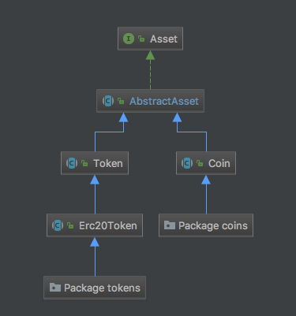

= How to list an asset

== Introduction

This document describes the process for listing a new ("crypto") asset on the Bisq exchange. Anyone with sufficient technical skill to follow the instructions below can list any asset. There are no fees involved in this process.

Please note that Bisq does not implement any technical infrastructure for listed assets, such as wallets, full nodes, block explorers, etc. Rather, Bisq simply supports users adding an address for any listed asset as a _payment account_ that can be used to settle trades for bitcoin. The process of sending and receiving such asset payments, like the process of sending and receiving fiat payments, is not an integrated part of the Bisq application; traders must use their own wallet software to perform actual transfers for such assets.

NOTE: This document replaces the earlier process description in the link:https://bisq.community/t/how-to-add-your-favorite-Altcoin/46[Bisq forum] and the earlier document at https://bisq.network/list-token.

== Prerequisites

=== The asset must have an official block explorer

The asset must have an active, publicly available block explorer.

=== The asset ticker symbol must not conflict with national currency tickers

The ticker symbol must not conflict with one of the national currency ISO 4217 ticker symbols listed at https://en.wikipedia.org/wiki/ISO_4217.

=== The asset ticker symbol must not conflict with other asset ticker symbols

The ticker symbol must not conflict with one of the top 100 cryptocurrency / crypto-asset ticker symbols listed at: https://coinmarketcap.com/currencies at the time of PR creation.

=== The asset must not impose additional technical requirements

Be sure that the requirements to add the asset do not cause extra effort for Bisq maintainers, e.g. requiring additional input fields because the address alone is not sufficient for a trade.

=== Arbitrators must be able to look up transactions in the asset block explorer

A Bisq arbitrator must be able to look up transactions in the asset's block explorer by using the receiver's address. In case that is not possible as a result of enhanced privacy features e.g. in Zcash, Monero and CryptoNote coins, a suggested solution needs to be added to the asset listing pull request (e.g. in Zcash we support only transparent addresses not z-addresses; in Monero we require that the user is using a Monero wallet which supports transaction keys to enable 3rd party audits of the transaction which is used in case of a dispute). As such additional cases require additional effort (popup with background info) it will be up to Bisq contributors whether to add a pull request for the popup and translation strings. Of course the code or the popup can be part of the PR as well but a more detailed description is out of scope of this document.

== Instructions

IMPORTANT: Each of the steps described below deal with code in the https://github.com/bisq-network/bisq-assets repository. You will need to fork this repository, make the specified changes, and then submit those changes as a SINGLE COMMIT within a SINGLE PULL REQUEST. Please DO NOT issue several pull requests by attempting to modify the sources one by one via the GitHub web UI. You need to have a competent developer make these changes and actually run the tests. *To be extra clear:* If you are unfamiliar with Java, don't know what a "pull request" is, or have never created a pull request yourself, please do not attempt to follow the instructions below on your own.

=== Step 1. Implement your asset

[#asset-hierarchy]
.The `bisq.asset.Asset` type hierarchy

All assets listed on the Bisq exchange ultimately implement the https://jitpack.io/com/github/bisq-network/bisq-assets/-SNAPSHOT/javadoc/bisq/asset/Asset.html[`bisq.asset.Asset`] interface. Your asset implementation will need to extend the https://jitpack.io/com/github/bisq-network/bisq-assets/-SNAPSHOT/javadoc/bisq/asset/Coin.html[`Coin`], https://jitpack.io/com/github/bisq-network/bisq-assets/-SNAPSHOT/javadoc/bisq/asset/Token.html[`Token`] or https://jitpack.io/com/github/bisq-network/bisq-assets/-SNAPSHOT/javadoc/bisq/asset/Erc20Token.html[`Erc20Token`] subtypes as appropriate.

TIP: The links above point to Javadoc for each respective type. Read it!

TIP: Look through existing concrete `Asset` implementations for one most similar to yours and use it as a baseline.

`Coin` implementations must be located within the `bisq.asset.coins` package. `Token` implementations must be located within the `bisq.asset.tokens` package.

For example, if you are listing a new `Coin` named `FooCoin`, its fully-qualified name should be `bisq.asset.coins.FooCoin`.

TIP: Follow existing coding conventions. Everything from license headers to import statements to indentation and blank lines matters. Make your implementation look _exactly_ like the other `Asset` implementations you see.

=== Step 2. Register your asset

Register your asset by adding an entry to the `META-INF/services/bisq.asset.Asset` provider-configuration file.

Entries in this file must be kept in alphabetical order.

=== Step 3. Write tests for your asset

Create a new `AbstractAssetTest` subclass for your asset, named e.g. `FooCoinTest` and implement the required methods as appropriate.

TIP: Again, look to existing `AbstractAssetTest` implementations for a baseline as to how your own should look.

=== Step 4. Compile and test everything

Run the following command and ensure you get a successful result.

----
./gradlew build
[...]
BUILD SUCCESSFUL
----

=== Step 5. Create a well-formed Git commit

Your changes should be squashed into a SINGLE GIT COMMIT with a commit message that reads as follows:

----
List [asset name] ([ticker symbol])
----

For example:

 - List Litecoin (LTC)
 - List Monero (XMR)
 - List Zcash (ZEC)

Your Git author metadata should include your full name (or nym) and email address. For example, this is what your commit metadata, a la `git log` should look like:

----
Author: Roger Pollack <mrslippery@protonmail.com>
Date:   Wed Aug 1 00:00:00 1979 -0800

    List OtherPlane (OTP)
----

=== Step 6. Submit your pull request

Your pull request should be submitted against the bisq-network/bisq-assets repository's `master` branch. Make sure you do this from a dedicated topic branch in your fork named, for example, `list-foo-asset`. Do not submit your pull request directly from your `master` branch, as this can make things unnecessarily complex if and when there are merge conflicts.

Copy and paste the form template below into the description of the pull request and fill it out.

----
- Official project URL: [url]
- Official block explorer URL: [url]
----

IMPORTANT: When submitting your pull request, please check the `Allow edits from maintainers` box. See https://github.com/bisq-network/style/issues/4 for details.

== Caveats

=== Controversial assets may be put to a vote

Accepting a request to list a given asset does not imply endorsement of that asset by Bisq maintainers, contributors or co-founders. Bisq maintainers merge or reject asset listing pull requests based strictly on the formal requirements laid out in this document, not on any political, legal or ethical grounds.

However, any BSQ stakeholder can request that listing a given asset be put to a vote under the normal Bisq DAO voting process.

If such a request for voting is filed, the PR will be delayed until the next voting period. Filing a request for voting is described at https://bisq.network/phase-zero.

If the vote has greater than 50% approval and reaches the required quorum (at least 5% of total BSQ stake need to vote on it) the result will be used to accept or reject the asset. Not reaching the quorum results in a rejection.

To request listing an asset that has already been rejected by such a vote, the requester must include a clear statement about what has changed since the original vote.

Any BSQ stakeholder can also request a vote to remove an already-listed asset.

=== Inactive assets will be de-listed

At each new release we will check whether already-listed assets have been traded in the past 4 months. If this requirement is not met the asset will be removed. The Bisq trade statistics are used as a reference. Removal of an un-traded asset will not be announced outside of normal release notes.

Listing the asset again will require a statement about what has changed since the original de-listing, e.g.: links to discussions where demand for the asset is documented, etc.

=== Getting a new asset into production may take a while

Whenever we ship the next Bisq release, your newly-listed asset will be included and become available for trading. We typically ship once every few weeks, but there is no fixed release schedule, and release intervals can vary widely.

=== Pull requests that do not conform to the requirements above will be rejected

If your pull request is for any reason incorrect, e.g. code does not compile, tests do not pass, steps have been missed in the instructions, your changes will be ignored and your pull request will be closed. Getting your asset successfully listed is 100% your responsibility. If you follow the instructions, the `bisq-assets` maintainers will merge it; if you don't, they won't. It's that simple.
