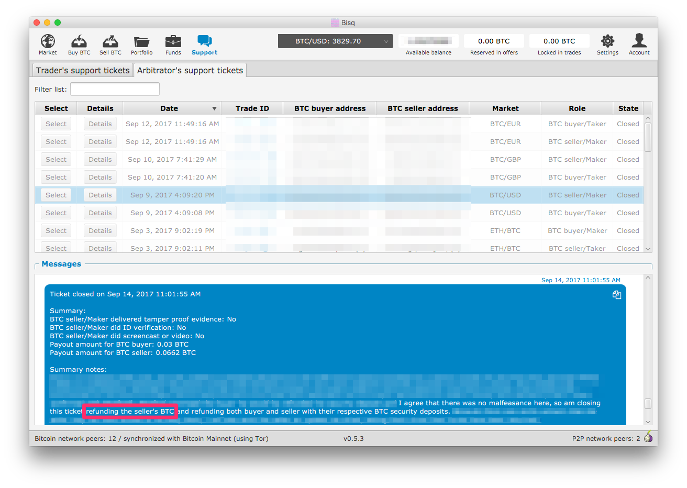
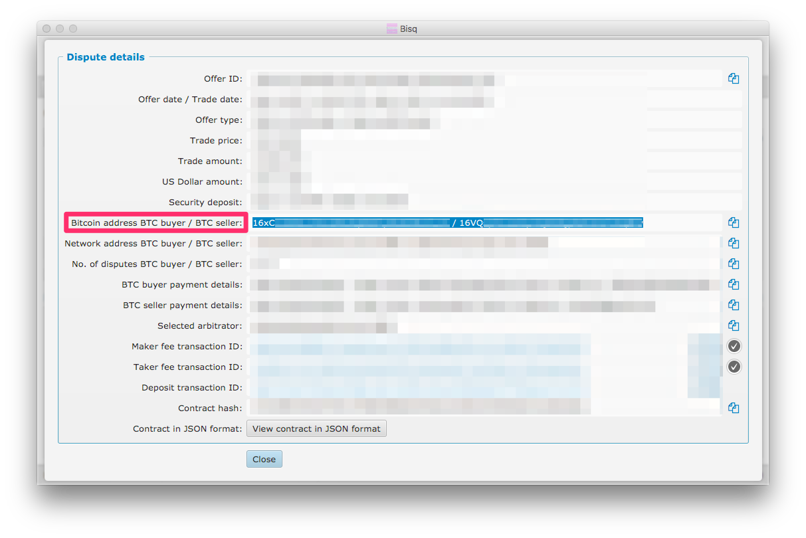
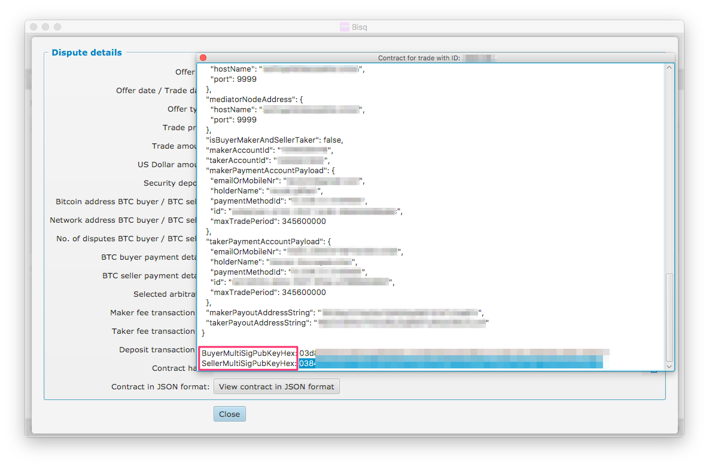
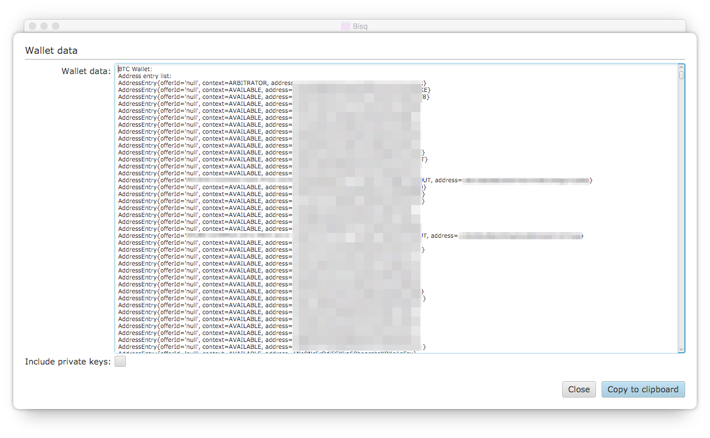
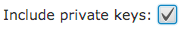

= How to issue a manual dispute payout

== Introduction

In rare cases, it can become necessary for an arbitrator to work with a trader to issue a multi-sig payout transaction manually. This doc explains the steps that both the arbitrator and trader must take to make this happen.

== Arbitrator instructions

The instructions that follow assume that a trade dispute has already been opened, arbitrated and closed, but that for some reason the payout transaction has not occurred as expected.

One reason that a payout transaction may not go through is because the "winner" of the dispute (i.e. the trader who is being awarded the trading amount) has not come online since the ticket has been closed. It is necessary for the winner's Bisq client to come online in order to actually sign their part of the 2-of-3 multi-sig transaction. If you believe this is the problem, you should *not* jump straight to a manual payout. You should first:

 1. Re-open both buyer and seller tickets for this trade using `cmd-U`
 2. Re-close the ticket of the "losing" (i.e. the trader who is *not* receiving the trade amount, this time checking the "Use loser as publisher" checkbox.

Assuming that the loser comes online, their client will be used to sign the multi-sig transaction and the payout will be issued to the winner.

If the approach above does not work, and you believe there is no way to issue the payout transaction using normal mechanisms in the Bisq client and protocol, then continue below with the instructions to issue a manual payout.

[TIP]
.Fill this out as you go
====
Paste the following into a text editor and fill out the individual values as you follow the steps below. You'll use these values when submitting the actual manual payout form in <<issue-payout>>.
----
depositTxHex:
buyerPayoutAmount:
sellerPayoutAmount:
arbitratorPayoutAmount:
Tx fee:
buyerAddressString:
sellerAddressString:
arbitratorAddressString:
buyerPrivateKeyAsHex:
sellerPrivateKeyAsHex:
arbitratorPrivateKeyAsHex:
buyerPubKeyAsHex:
sellerPubKeyAsHex:
arbitratorPubKeyAsHex:
P2SHMultiSigOutputScript:
----
====

=== Step 1. Review dispute details

In `Support > Aribtrator's support tickets`, find the trade dispute in question, select it, and *review the closing chat message to determine who was the "winner" of the dispute*, i.e. who was supposed to have received the trading amount payout. For example, the closing comments on the dispute below make it clear that it was the seller who won the dispute:

If the seller was the winner, you will need to work with the seller to issue the manual payout, meaning you will need the seller's public and private key pair as opposed to the buyer's. For simplicity's sake, the instructions in the remainder of this document assume the seller as the winner. You will need to adjust these instructions accordingly if it was in fact the buyer who was the winner.

While looking at the closing chat message, *take note of the payout amounts for both buyer and seller*. You will need these values in steps below.

Next, click the `Details` button on the dispute ticket, and *take note of the BTC address for both buyer and seller*:

Next, click the `View contract in JSON format` button and *take note of both the `BuyerMultiSigPubKeyHex` and `SellerMultiSigPubKeyHex` values*—you will need both when filling out the payout form:

Also *take note of the `txFee` value in the contract JSON*, e.g.:

   "txFee": 36000,

This is the value of the Bitcoin transaction fee denominated in satoshis. Later, *you will need the same transaction fee value denominated in BTC*, which can be found by dividing the satoshi value by 100,000,000, e.g.:

    36000/100000000 = 0.00036000 BTC

Next, close the JSON contract window and click on the `Deposit transaction ID` link in the dispute details dialog to open it in a block explorer (e.g. blockchain.info as shown below). In transaction details web UI, click on the "Show scripts" link and *take note of the P2SH multi-sig output script hex value*:

=== Step 2. Get arbitrator's public and private key

*Remove your wallet password* (by following the same steps as found in <<remove-password>> in the trader instructions section).

*Open the Wallet Data* dialog with `cmd-j` and *check the `Include private keys` checkbox*.

*Copy the contents of the Wallet Data dialog* and paste it into a text editor.

Note the `ARBITRATOR` address at the top of the file in the BTC Wallet Address entry list, i.e. the entry with `address=1DBX...` below. This address should be the same as the one that you receive funds to as an arbitrator:

    BTC Wallet:
    Address entry list:
    AddressEntry{offerId='null', context=ARBITRATOR, address=1DBX...}
    AddressEntry{offerId='null', context=AVAILABLE, address=1HN2...}

Now search the file for the first match for the string `addr:1DBX...`. You should find a section that looks like the following:

    Key to watch:  xpub...
     addr:1ABC...  hash160:f778...
     DeterministicKey{pub HEX=02ff..., priv HEX=dfc8..., ...}
     addr:1DBX...  hash160:760d...
     DeterministicKey{pub HEX=039d..., priv HEX=929d..., ...}

*Note both the `pub HEX` and `priv HEX` values for the `addr:1DBX...` entry*, which should be the second entry in the list.

You can now *reset your wallet password*.

=== Step 3. Get trader's private key

First, navigate back to the trade dispute ticket in question. *Re-open both buyer and seller tickets* by clicking on each and pressing `cmd-U`.

Click on the winning trader's dispute ticket and *send the trader their public key* (as determined in the steps above) *as well as a link to the <<trader-instructions>> section of this document*. Ask them to follow those instructions and to respond to you with their private key value once they have it.

When you have the trader's private key, move on to the next step.

[[issue-payout]]
=== Step 4. Issue the manual dispute payout

Now that you have all the necessary information, you can *open the Emergency multisig payout tool* by clicking `alt-g` in the dispute view:

depositTxHex:: The Deposit transaction ID from the Dispute details view, i.e. the same transaction ID you clicked on to view the transaction in a block explorer.

buyerPayoutAmount:: The amount in BTC that the buyer should be paid out, as noted above, e.g. `0.03`

sellerPayoutAmount:: The amount in BTC the seller should be paid out, e.g. `0.0662`

arbitratorPayoutAmount:: This value should always be `0`, as we no longer issue payouts to arbitrators

Tx fee:: The value of the `txFee` taken from the JSON contract details above, after converting from satoshis to BTC, e.g. `36000` satoshis => `0.00036` BTC

buyerAddressString:: The buyer's bitcoin address

sellerAddressString:: The seller's bitcoin address

arbitratorAddressString:: The arbitrator's bitcoin address

buyerPrivateKeyAsHex:: The buyer's private key (leave empty if buyer was not the winner)

sellerPrivateKeyAsHex:: The seller's private key (leave empty if seller was not the winner)

arbitratorPrivateKeyAsHex:: The arbitrator's private key

buyerPubKeyAsHex:: The buyer's public key

sellerPubKeyAsHex:: The seller's public key

arbitratorPubKeyAsHex:: The arbitrator's public key

P2SHMultiSigOutputScript:: The P2SH multi-sig output script hex value as copied from the block explorer

When all values have been entered (and double-checked!), click `Sign and publish transaction` to issue the payout.

When you have confirmed that the payout transaction worked as expected, *let the trader know and close out the re-opened buyer and seller tickets*.

== Trader instructions

[WARNING]
The instructions below require you to share sensitive private key information with your arbitrator in order to assist in a manual multi-sig payout. This is necessary only in extraordinary situations, e.g. when a bug or network issue has caused the normal, automated multi-sig payout process to fail. In the unlikely event that you do need to follow these instructions, *you should never share private key information with anyone other than your arbitrator*, and *you should send your private key information only via the Bisq support ticket chat interface*. Also note that the private key the arbitrator is requesting from you is specific to the trade in question. All other trades and funds in your Bisq wallet have different addresses and different private keys.

=== Step 1. Get your public key from your arbitrator

Your arbitrator will follow the link:#arbitrator-instructions[instructions] above to determine which of your public keys was used to participate in the multi-sig transaction.

Wait for your arbitrator to provide you with this value. They will send it to you via the Bisq support ticket chat interface. When you have received the public key from the arbitrator, move on to the next step.

=== Step 2. Remove your wallet password [[remove-password]]

Removing your wallet password is necessary in order to get the unencrypted value of your corresponding private key in the next step.

Go to `Account > Wallet Password`, enter your password and click the `Remove password` button:

When your wallet password has been removed, you should see the following:

You can now move on to the next step.

=== Step 3: Send your private key to your arbitrator

Press `cmd+j` on macOS or `ctrl-j` on Windows to *open Bisq's Wallet Data dialog*. You should see a screen similar to the following:

At the bottom of the dialog, *check the box that reads `Include private keys`*:

Then *click `Copy to clipboard`*.

Open the text editor of your choice, e.g. TextEdit on macOS or Notepad on Windows, and *paste the copied wallet data text* into it.

In the text editor, *search for the public key value your arbitrator provided* in step one above. You're looking for an entry that reads `DeterministicKey{pub HEX="..."`, where `...` is the public key. It should be the first search result in the file.

When you have found this entry, select and *copy the `priv HEX=...` value* that immediately follows the `pub HEX` value. *This value is your private key*.

Close the text editor. When prompted, *do not save the file*.

Back in your Bisq client, *send your private key to your arbitrator* by pasting it into the support ticket chat window.

Your arbitrator will take over from here, and use your private key to issue the multi-sig payout. They will stay in touch with you to let you know when it is complete.

=== Step 4: Reset your wallet password

The final step is to reset your wallet password.

Go to `Account > Wallet Password`, enter and confirm your password and click `Set password`.
